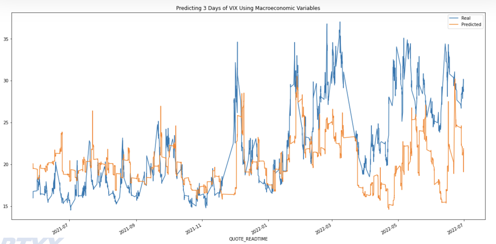
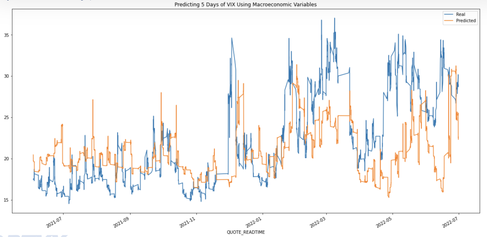
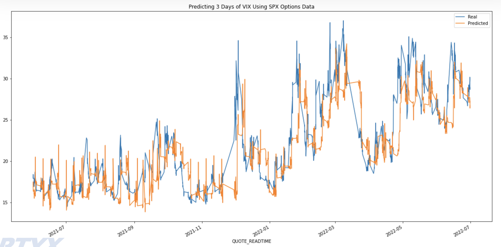
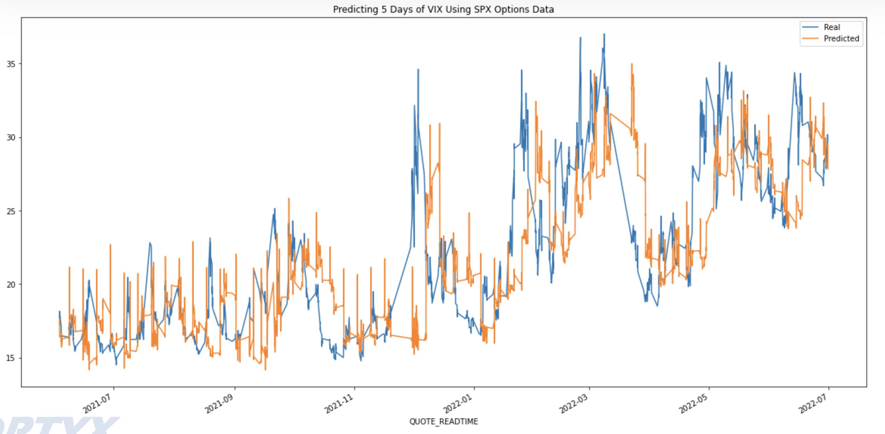

**Contained within this repo is a collection of approaches for forecasting the CBOE VIX for the purpose of improving future market volatility forecasts.** 

The CBOE VIX is a real-time index that represents the market’s expectations for the relative strength of near-term price changes or future volatility of the S&P 500 Index (SPX), which is considered the leading indicator of the broad U.S. stock market. Being a forward-looking index, it is constructed using the implied volatilities on S&P 500 index options (SPX options). 

Volatility, or how fast prices change, is often seen as a way to gauge market sentiment, and in particular the degree of fear among market participants. Having the ability to guage this sentiment in advance allows insight into the timing of indicators and assists traders in enhancing long-term fundamentals to better execute their market entries.  

Volatility forecasts are used for risk management, alpha (risk) trading, and the reduction of trading friction.

---

## __README Overview__

This README serves as a blueprint for navigating the entire repo. The following instructions will guide the user through the process of installing necessary libraries and running the applicable Jupyter notebooks, as well as provide a step-by-step explanation of the code's usage and results.

Included here is an explanation of the data gathering process for all data, relevant to Parts 1, 2, and 3, as well as a summation of the study's findings for Part 1. 

Please note, this repo is a copy of an earlier version. Commits were made on the earlier version starting August 15th, 2022. A new repo was created August 27th in the interest of cohesion. 

---

## __Technologies__

This application leverages Python 3.7. 

---

## __Installation Guide__

Begin by cloning the GitHub repo (the same repo that this README.md file is contained within) into your terminal. 

Next, activate the correct environment by inputting the following command into your terminal:
`conda activate dev`.

Within this environment, install the above listed dependencies. To do so, in your terminal while in this same repo, enter `pip install -r requirements.txt`.

---

## __Data Gathering__ 

Please navigate to the **Data Prep** folder to review the following notebooks:

***Macro_Data_2017-22_Prep.ipynb***:

* Various macroeconomic data was pulled from [FRED](https://fred.stlouisfed.org/) for a period spanning January 2017 (Q1) through June 2022 (Q2). For a complete review of all data pulled, please consult the **VIXbyOptyxFinal.pdf** presentation in the __Presentation__ folder, pages 6-7.

* Each set of marcroeconomic data was coverted into a Pandas DataFrame and formatted. 

* All macroeconomic DataFrames were then merged together along with 30-minute VIX data (pulled from [optionsDx](https://www.optionsdx.com/)).

* Together, this dataset comprises the features used in all LSTM models that contain macroeconomic data (detailed below). 

***SPX_VIX_30min_2017-22_Prep.ipynb***:

* Thirty-minute call and put data for SPX option contracts (e.g. Strike Price, SPX Price, Greeks, Expiration, Bid, Ask, etc.) from January 2017 (Q1) through June 2022 (Q2) was directly pulled from [optionsDx](https://www.optionsdx.com/) and downloaded in the form of text files, with each month of data being a separate file. 

* Each month was then converted into a Pandas DataFrame and further filtered. 

* Once the data was formatted accordingly, each month from 2017-2019 was concatenated into one large dataset for this period and likewise each month from 2020-2022 was concatenated into one large dataset for this period. Note, the periods 2017-2019 and 2020-2022 were initially processed separately from each other due to their large file sizes. 

* Each period was then further filtered according to the following criteria in order to create a subset of the most liquid options:

  - *All options, at any given point in time, must satisfy the following:*

    -   *Expiration date between 27 and 32 days in the future*
    -   *Bid and ask greater than $0.0*
    -   *Strikes within .4% of spot at beginning of day*

- Both periods were then concatinated.

- Each contract is then weighted based on their impact on the VIX. For further explanation regarding this process, please consult the **VIXbyOptyxFinal.pdf** presentation in the __Presentation__ folder, pages 15-18.

  -   Every timestamp (30 min intervals) becomes a weighted average of ~10-20 contracts (E.g., the C_DELTA feature: consists of a weighted average of all call option contracts’ delta values based on their strike value’s impact on the VIX index.)

* This weighted, 30-minute SPX option contract dataset for the 5.5 year period is then merged with 30-minute VIX data (likewise directly pulled from [optionsDx](https://www.optionsdx.com/)). Together, this dataset comprises the features used in all LSTM models that contain SPX-Options data (detailed below). 

---

## __PART 1: Predicting VIX with LSTM__

This section uses a multi-variate, multi-step LSTM model to predict how the VIX will evolve over time using 5.5 years of historical data (Q1 2017 through Q2 2022).

For this project, three, five, and 20 day forecasts were made. Please note 20 days provided insufficient predictive power; results will not be discussed.

***vix_lstm_V4.ipynb***:

- This notebook contains the LSTM data preparation and model. This notebook was used to create the following models:

  -  Macroeconomic-only features, predicting three days
  -  Macroeconomic-only features, predicting five days
  -  SPX Options-only features, predicting three days
  -  SPX Options-only features, predicting five days
  -  Permutations of macroeconomic and SPX Options features, predicting three days
  -  Permutations of macroeconomic and SPX Options features, predicting five days

- Please note, permutations of macroeconomic and SPX Options features, predicting both three and five days, vastly underperformed compared to their homogeneous componenents by themselves. Their results will not be discussed.

- For details on the LSTM model architecture, please consult the **VIXbyOptyxFinal.pdf** presentation in the __Presentation__ folder, page 19.

***LSTM Results:***

  -  Macroeconomic-only features, predicting three days: RMSE = 5.380

  

  -  Macroeconomic-only features, predicting five days: RMSE = 5.520

  

  -  SPX Options-only features, predicting three days: RMSE = 3.257

  

  -  SPX Options-only features, predicting five days: RMSE = 3.957

  

---

## __PART 2: Monte Carlo and Facebook Prophet__

Monte Carlo analysis was additionally performed to forecast the VIX for the first two weeks of August 2022. 

Further, Facebook Prophet was likewise performed to forecast the VIX for six months starting August 1st, 2022 as well as the first two weeks in August 2022.

Please consult the **VIXbyOptyxFinal.pdf** presentation in the __Presentation__ folder, pages 22-25 for Monte Carlo and Facebook Prophet results.

---

## __PART 3: Scenario Forecasting__

This folder consists of scenario forecasts for the VIX. The goal was to manipulate certain features for an LSTM time-series model as a means of simulating various scenarios. 

For example, in Scenario A (one scenario of three included), to simulate a period of hyper-inflation alongside a pandemic, the following features were manipulated by scaling them in a step-wise fashion over select periods: 

* Inflation

* Equity Market Volatility Infectious Disease Tracker

* VVIX

Here are the three scenarios:

  - A.) Forecasts a situation where a new aggresive virus broke out and had a downstream impact on supply chain flow. Explores the relationship when the Equity Market Volatility Infectious Disease Tracker is showing concerning numbers, and the supply chain stress indicator is signaling trouble, while economic policy is highly uncertain.

  - B.) Explores the outcome if all currencies rapidly devalue and cryptocurrency becomes the main currency in the world.

  - C.) Explores a situation where the US is facing hyperinflation. Financial conditions are tight, unemployment is skyrocketing, the dollar is climbing while losing value against the EUR, and the Fed rate is at a never seen before level.

---

## __Contributors__

Kfir Bar,
Aarchit Malhotra,
Aliza Naqvi,
Nicole Roberts,
Wilson Rosa
